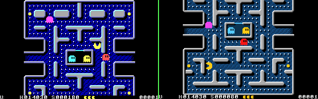

PAKU-PAC
--------

Heavily Based on the code by alex james macpherson https://github.com/alexjamesmacpherson/pacman
and jsmolina https://github.com/jsmolina/z88dk-tutorial-sp1/blob/master/logic.c#L442

If there is any problem with the license just tell me, I don't really know which one to use.

This was inspired by paku paku, a pacman clone that works on an 8088 4.77 Mhz with CGA.
But this is a "full scale" pacman, so it requires the EGA card, which is capable of some
hardware acceleration (simple "sprites", hardware window, scrolling, 32 bit mov from vram to vram).

REQUIREMENTS
------------

- CPU: 8088 4.77 MHz or equivalent
- RAM: 64 KB (if you use bootable image or PC-DOS), 128 KB (if you use MS-DOS).
- VIDEO: EGA (128KB)
- OS: Any MS-DOS or compatible.

ITEM POINTS: the same as in the original, but divided by 10, because I only use a 16 bit number

HIGH SCORES
This program saves the high score by creating a file called pakuscor.dat
